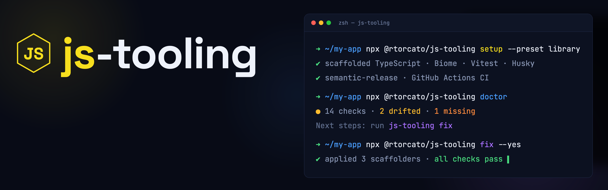
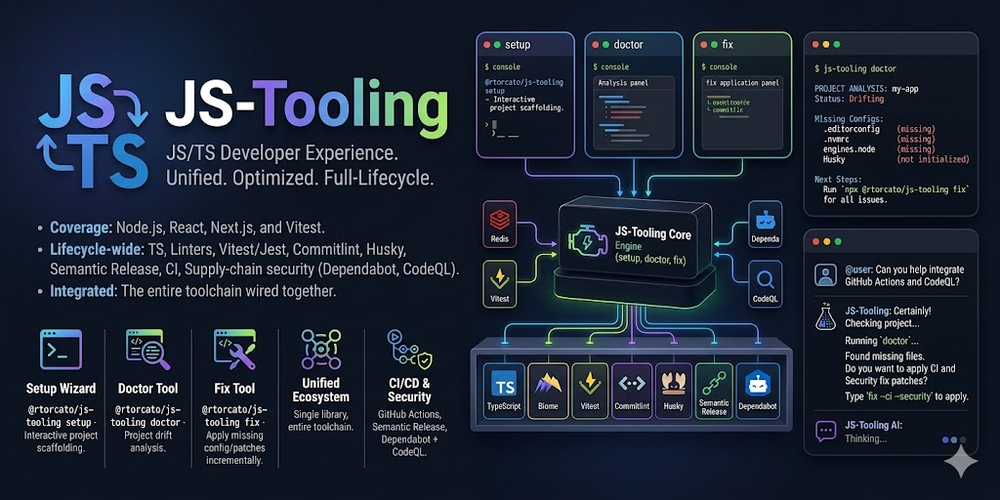

# js-tooling



JavaScript and TypeScript tooling for Node.js, React, Next.js, and Vitest.

[](https://github.com/rtorcato/js-tooling/actions/workflows/ci.yml)
[](https://badge.fury.io/js/@rtorcato%2Fjs-tooling)
[](https://www.npmjs.com/package/@rtorcato/js-tooling)
[](https://bundlephobia.com/package/@rtorcato/js-tooling)
[](https://codecov.io/gh/rtorcato/js-tooling)
[](https://opensource.org/licenses/MIT)

Most tooling libraries give you one piece — just TypeScript configs, or just an ESLint preset. **js-tooling** covers the entire lifecycle: TypeScript, Biome/ESLint, Vitest/Jest, Commitlint, Husky, Semantic Release, GitHub Actions CI, and supply-chain security (Dependabot + CodeQL) — all wired together. The interactive `setup` wizard scaffolds everything in one shot; `doctor` checks an existing project for drift; `fix` applies the missing pieces incrementally.

**[Full documentation →](https://rtorcato.github.io/js-tooling/)**

> **Package manager: pnpm, by design.** Every generator scaffolds pnpm
> workflows, workspace files, and scripts. js-tooling targets pnpm only for
> now — npm, yarn, and Bun aren't generated.

## Start a new project

Interactive wizard — answers every prompt, scaffolds the whole project:

```bash
npx @rtorcato/js-tooling setup
```

Non-interactive — scaffold from a named preset in one shot (CI-friendly):

```bash
npx @rtorcato/js-tooling setup --preset library -d ./my-lib --skip-install
# presets: library | web-app | node-api | nextjs-app | react-app
```

Just one config file? Use `copy`:

```bash
npx @rtorcato/js-tooling copy biome        # → biome.json
npx @rtorcato/js-tooling copy tsconfig     # → tsconfig.json
npx @rtorcato/js-tooling copy changesets   # → .changeset/config.json
npx @rtorcato/js-tooling copy oxlint       # → .oxlintrc.json
npx @rtorcato/js-tooling copy claude-skill # → .claude/skills/js-tooling.md
```

**Already have a project?** Don't rerun `setup` — use `doctor` + `fix`:

```bash
npx @rtorcato/js-tooling doctor   # find what's missing or drifted
npx @rtorcato/js-tooling fix      # apply scaffolders, prompting per item
```

See the [Getting Started guide](https://rtorcato.github.io/js-tooling/guides/getting-started/) for the full walkthrough.

## Commands

| Command | What it does | Example |
| --- | --- | --- |
| `setup` | Interactive wizard that scaffolds a whole new project (add `--preset` to run non-interactively). | `npx @rtorcato/js-tooling setup` |
| `list` | List every tooling configuration this package can scaffold (`--json` for machine output). | `npx @rtorcato/js-tooling list` |
| `copy <config>` | Copy a single config file into the current project. | `npx @rtorcato/js-tooling copy biome` |
| `doctor` | Diagnose an existing project for missing or drifted tooling. | `npx @rtorcato/js-tooling doctor` |
| `fix [target]` | Apply scaffolders for what `doctor` flagged (`--yes`, `--dry-run`, `--diff`). | `npx @rtorcato/js-tooling fix` |

Every command takes `-d, --directory <path>`; run any with `--help` for its full flags. Run `list` (or `list --json`) for the full set of `fix` targets — it's the source of truth. Notable ones include `fix docs-site` (scaffold a [Docusaurus docs site](https://rtorcato.github.io/js-tooling/guides/docs-site/)) and `fix bun` (Bun runtime config).

## The `.js-tooling.json` lockfile

An **optional** manifest that records the tooling choices you adopted. Nothing
reads it at build/lint/test time — it exists only so `doctor` can tell an
*intentional opt-out* from *drift*. js-tooling works fine without it, which is
why `doctor` reports a missing one as `not configured`, not an error.

Generate or refresh it from what's currently on disk:

```bash
npx @rtorcato/js-tooling fix lockfile
```

Each `config.*` key mirrors a setup answer — see the
[schema](https://rtorcato.github.io/js-tooling/schemas/lockfile.json) for the
full field reference. The keys `doctor` acts on:

- `typescript.enabled` / `typescript.config` — `base` \| `react` \| `next` \| `node` \| `express`
- `linting.tool` — `biome` \| `eslint` \| `both` \| `none`
- `formatting.tool` — `biome` \| `prettier` \| `none`
- `testing.framework` — `vitest` \| `jest` \| `playwright` \| `none`
- `gitHooks`, `commitLint`, `semanticRelease` — booleans
- `securityAutomation` — boolean (Dependabot + CodeQL)
- `bundler` — `tsup` \| `esbuild` \| `vite` \| `none`
- `aiSetup` — boolean (AGENTS.md, CLAUDE.md, Cursor/Copilot rules)

**How opt-outs actually work.** When the lockfile records that you declined an
*optional* tool (e.g. `securityAutomation: false`), `doctor` demotes that check
from `not configured` to `ok — intentionally declined` instead of nagging you to
add it. This applies only to optional checks — it does **not** silence *drift*:
if a config you adopted diverges from the shared base (say your `tsconfig.json`
extends a different preset), `doctor` still flags it, because drift is a mismatch
in a tool you're using, not an opt-out. There's no field to suppress drift today.

**Adoption vs. standalone.** `fix lockfile` infers adoption from what's on disk,
so on a repo that deliberately runs standalone configs (no
`@rtorcato/js-tooling` dependency) it can record `typescript.config: "base"` and
friends — asserting you extend the shared bases when you don't. If you're not
adopting js-tooling's configs, skip the lockfile; it won't stop the `extends`
drift warnings.

## AI agent rules

The package ships rules that teach AI coding agents to drive the CLI
(`doctor` / `fix` / `setup`) non-interactively. Install for your agent — all
generated from one source, so guidance never drifts between them:

```bash
npx @rtorcato/js-tooling fix claude-skill --yes           # → .claude/skills/js-tooling.md
npx @rtorcato/js-tooling fix cursor-rules --yes           # → .cursor/rules/js-tooling.mdc
npx @rtorcato/js-tooling fix copilot-instructions --yes   # → .github/copilot-instructions.md
npx @rtorcato/js-tooling fix agents-md --yes              # → AGENTS.md
```

`copilot-instructions` and `agents-md` upsert a delimited block, so your own
content in those shared files is never clobbered. Re-running updates the block
in place on upgrade.

Prefer a symlink that auto-syncs the Claude skill on every upgrade?

```bash
mkdir -p .claude/skills
ln -sf ../../node_modules/@rtorcato/js-tooling/tooling/claude/js-tooling.md \
  .claude/skills/js-tooling.md
```

### Use with Claude Code (plugin)

This repo is also a self-hosted Claude Code marketplace. Install the plugin to
get two skills — `js-tooling` (adopt/audit the presets via the CLI) and
`npm-publish` (the family's release rules) — in any session:

```
/plugin marketplace add rtorcato/js-tooling
/plugin install js-tooling@js-tooling
```

### Use with other AI tools (Cursor / Copilot / Codex)

[`AGENTS.md`](AGENTS.md) at the repo root carries the same guidance in the
cross-tool convention many agents read, and ships in the npm tarball so tools
scanning `node_modules/@rtorcato/js-tooling` can find it.

## What's new

See [CHANGELOG.md](CHANGELOG.md) for the full history.

**v2.4.0** — New `fix` command applies scaffolders for items `doctor` flags, with `--yes` and `--dry-run` flags. Drift never auto-overwrites — every existing file you'd lose is confirmed first. Doctor grew checks for `engines.node`, `.editorconfig`, `.nvmrc`, Husky, `lint-staged`, semantic-release, knip, GitHub Actions, GitLab CI, Dependabot, and CodeQL — plus a `Next steps:` footer that names the exact `fix` command to run for each finding. Setup wizard adds a "Include security automation?" prompt for Dependabot + CodeQL.

**v2.0.0** — All 39 tool packages moved from `dependencies` to `peerDependencies`. Add them to your own `devDependencies`. Also ships: `doctor` subcommand, generator unit tests, Dependabot, CI matrix (Node 22 + 24).

**v1.1.0** — Stricter commitlint limits, fix for CLI path resolution when copying configs.

## Related packages

- [@rtorcato/js-common](https://github.com/rtorcato/js-common) — General TypeScript/JS utilities (strings, dates, numbers, async, errors)
- [@rtorcato/browser-common](https://github.com/rtorcato/browser-common) — Browser Web API wrappers (clipboard, observers, storage, etc.)

## Roadmap

See [ROADMAP.md](ROADMAP.md) for direction and the current
[milestones](https://github.com/rtorcato/js-tooling/milestones).

## Contributing

Contributions welcome — see [CONTRIBUTING.md](CONTRIBUTING.md).

## License

MIT — see [LICENSE](LICENSE).
